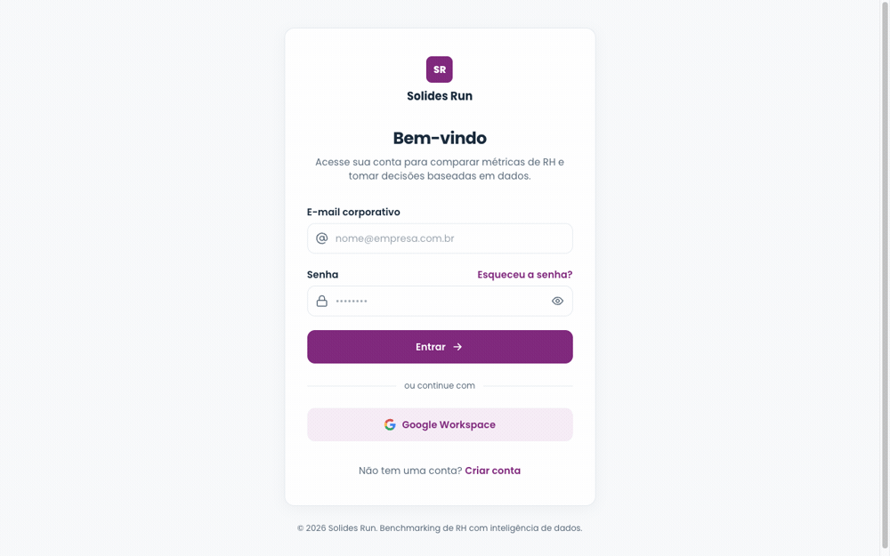

# Solides Run — Benchmark de RH

Plataforma de benchmarking de RH: compara os indicadores de uma empresa contra um **cohort anonimizado de pares** (k-anonimato ≥ 5, LGPD), calcula percentis e gera um diagnóstico acionável.

A retrieval roda um pipeline híbrido de verdade — **BM25 + dense retrieval (embeddings Ollama) + RRF + reranker** — e tudo é persistido em **PostgreSQL**: usuários, sessões, empresas e o histórico de benchmarks (que alimenta as tendências período-a-período).

## A jornada

Login → criar benchmark → pipeline → resultados → cohort → diagnóstico → tendências:



> Versão em vídeo (melhor qualidade): [`docs/journey.mp4`](docs/journey.mp4). Screencast contínuo gravado dirigindo o app real (Vite + Fastify + PostgreSQL + Ollama) com o `recordVideo` do Playwright — regenere com `pnpm record:journey` (precisa de `ffmpeg` e dos servidores no ar).

## Stack

Monorepo **pnpm workspaces + Turborepo**, tudo ESM e TypeScript.

- **`apps/web`** — React 19 + Vite. Proxy de `/api` → `:3000`.
- **`apps/api`** — Fastify 5, TypeScript nativo no Node (sem build). Persistência em PostgreSQL via `pg`, repositórios injetáveis.
- **`packages/engine`** — `@workshop/engine`: o pipeline de benchmark (BM25, dense, RRF, reranker, percentis, diagnóstico) + adapters Ollama.
- **`packages/shared`** — `@workshop/shared`: schemas zod + tipos compartilhados entre web e api.

## Pré-requisitos

- Node 25+ e pnpm 11+
- Docker (para o PostgreSQL)
- [Ollama](https://ollama.com) rodando com os modelos:
  ```bash
  ollama pull qwen3-embedding:0.6b
  ollama pull awenleven/Qwen3-Reranker-4B:Q4_K_M
  ```

## Como rodar

```bash
docker compose up -d          # PostgreSQL (:5432)
cp .env.example .env          # DATABASE_URL
pnpm install
pnpm dev                      # web :5173 + api :3000
```

No primeiro boot a API cria o schema e semeia as empresas-cliente e as contas demo.

**Conta demo:** `ana@solides.com` / `solides123`

## Comandos

| Comando | O que faz |
|---|---|
| `pnpm dev` | Sobe web (:5173) e api (:3000) juntos |
| `pnpm build` | Builda os pacotes que emitem `dist/` (`shared`, `engine`) |
| `pnpm test` | Roda todas as suítes (api/engine via `node:test`, web via Vitest) — **sem banco**, com repositórios in-memory |
| `pnpm typecheck` | Type-check de todos os pacotes |

## Arquitetura — persistência sem mocks

Os serviços dependem de **interfaces de repositório** (mesma ideia das ports `Embedder`/`Reranker` do engine):

- **Produção** injeta os repositórios PostgreSQL (`apps/api/src/repositories/postgres.ts`).
- **Testes** injetam os in-memory (`memory.ts`) — por isso `pnpm test` não precisa de banco.

Cada rota protegida valida o token de sessão (`Authorization: Bearer …`, 401 sem/ inválido) e os benchmarks são escopados por usuário. As **tendências são reais**: comparam o benchmark atual com o anterior da mesma empresa, lido do histórico.
