# Solides Run — walkthrough da jornada

Passo a passo da aplicação rodando **ponta a ponta com o backend real** (Fastify
+ `@workshop/engine` + Ollama), não com mocks. Cada captura abaixo foi tirada da
UI real (`apps/web`) conversando com a API (`apps/api`) via proxy `/api`.

O pipeline por trás de cada benchmark:

```
ingestão → dense retrieval (Ollama qwen) + BM25 → RRF → reranker (Qwen3-Reranker-4B)
         → cohort (top-K, k-anonimato ≥ 5) → percentis → diagnóstico
```

---

## 1. Autenticação

### Login
Sessão real: a senha é validada com **scrypt** no backend (`POST /api/auth/login`),
contas demo semeadas em memória.

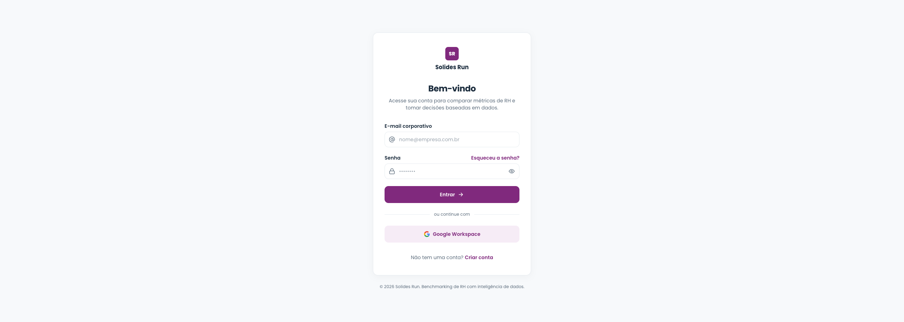

### Cadastro
`POST /api/auth/signup` — cria a conta (scrypt) e devolve a sessão. A empresa é
derivada do domínio do e-mail.

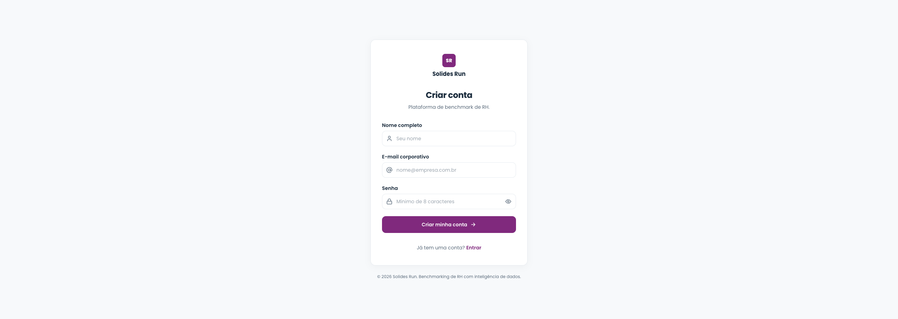

### Recuperação de senha
`POST /api/auth/reset` — sempre devolve uma mensagem genérica (não vaza se o
e-mail existe).

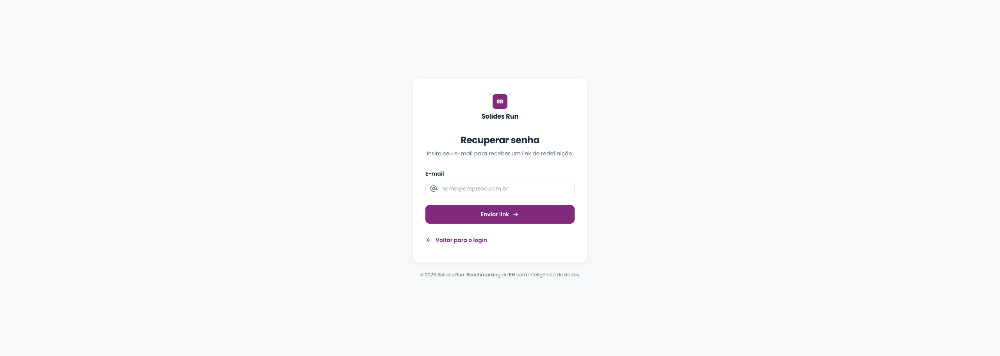

---

## 2. Lista de benchmarks (vazia)

`GET /api/benchmarks`. O store é em memória, então a primeira visita não tem
nenhum benchmark — diferente dos mocks, que vinham com dados fixos.

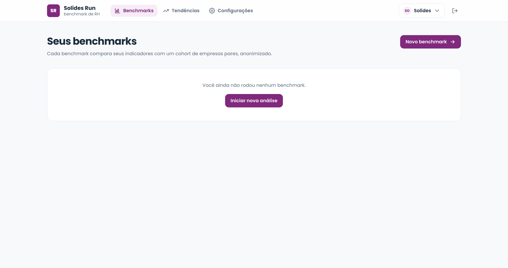

---

## 3. Novo benchmark

`GET /api/companies` popula o seletor de empresa-cliente (Solípse / Norvik /
Atlas, vindos do engine). Você escolhe o recorte do cohort (setor, porte, região)
e os indicadores. O aviso de **k-anonimato ≥ 5** é a regra LGPD aplicada no
backend.

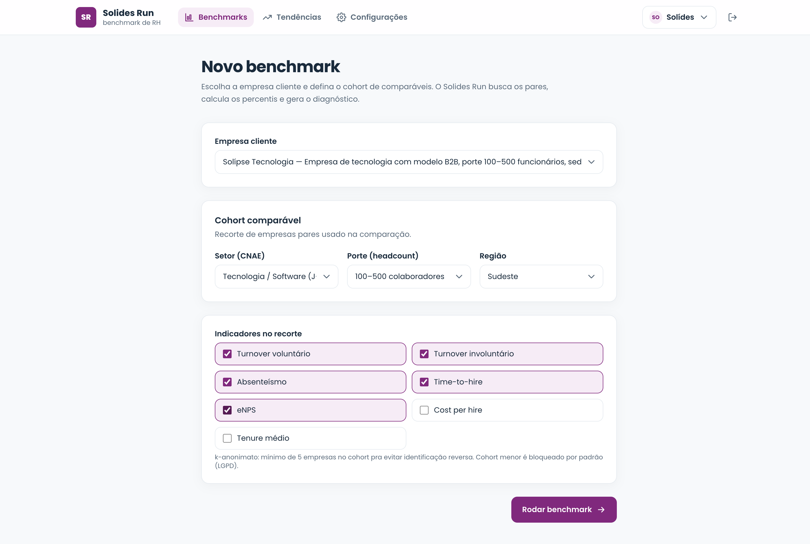

---

## 4. Pipeline rodando

`POST /api/benchmarks` dispara o pipeline assíncrono; a tela faz polling em
`GET /api/benchmarks/:id/status` (a cada 700 ms) e mostra as **7 etapas reais**
avançando. Aqui o reranker (`Qwen3-Reranker-4B` no Ollama) está reordenando os
candidatos.

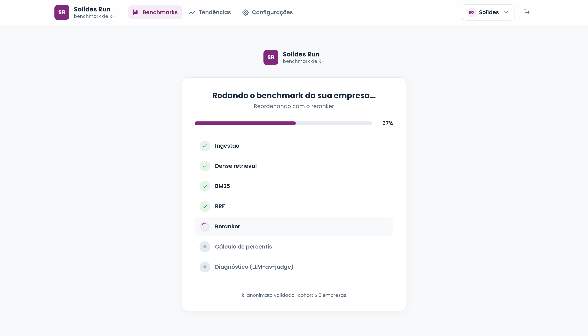

> Em máquinas rápidas o pipeline real termina em ~3 s. Para a captura, a API foi
> rodada com `PIPELINE_STAGE_DELAY_MS` (pacing opcional das etapas — só espaça os
> updates de progresso, **não altera o cálculo**).

---

## 5. Dashboard de resultados

`GET /api/benchmarks/:id`. Os KPIs vêm dos percentis calculados contra o cohort
real. A Solípse fica em **p100** em turnover/absenteísmo (pior que todos os pares)
e em **p0 / alta** no eNPS — a lógica de direção invertida funcionando (eNPS
baixo é alerta, não saúde).

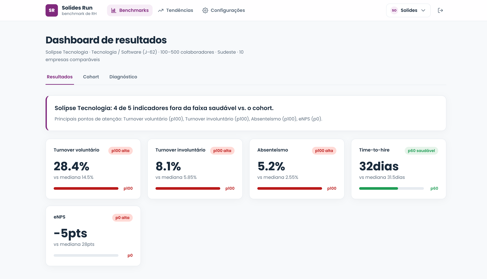

---

## 6. Cohort

`GET /api/benchmarks/:id/cohort`. As 10 empresas comparáveis, **anonimizadas**,
ordenadas pelo score do reranker. Todas do setor Tecnologia (filtro de setor
aplicado), origem `ambos` (apareceram no retrieval denso **e** no BM25), com
`k-anonimato ≥ 10`.

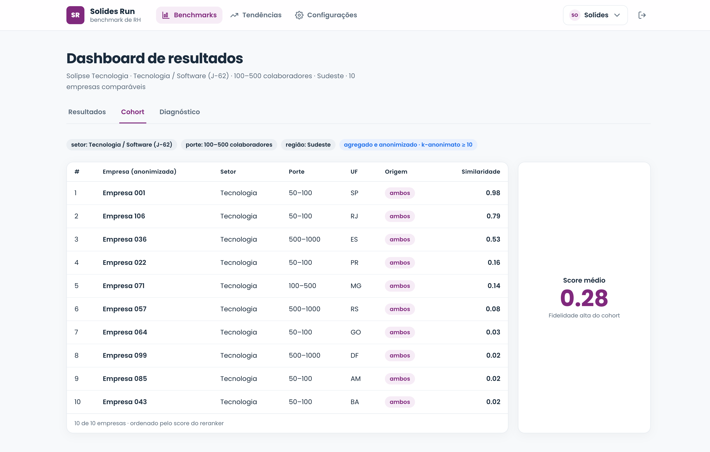

---

## 7. Diagnóstico

`GET /api/benchmarks/:id/diagnostic`. Indicadores críticos, **3 hipóteses de
investigação** derivadas dos piores indicadores e uma próxima ação.

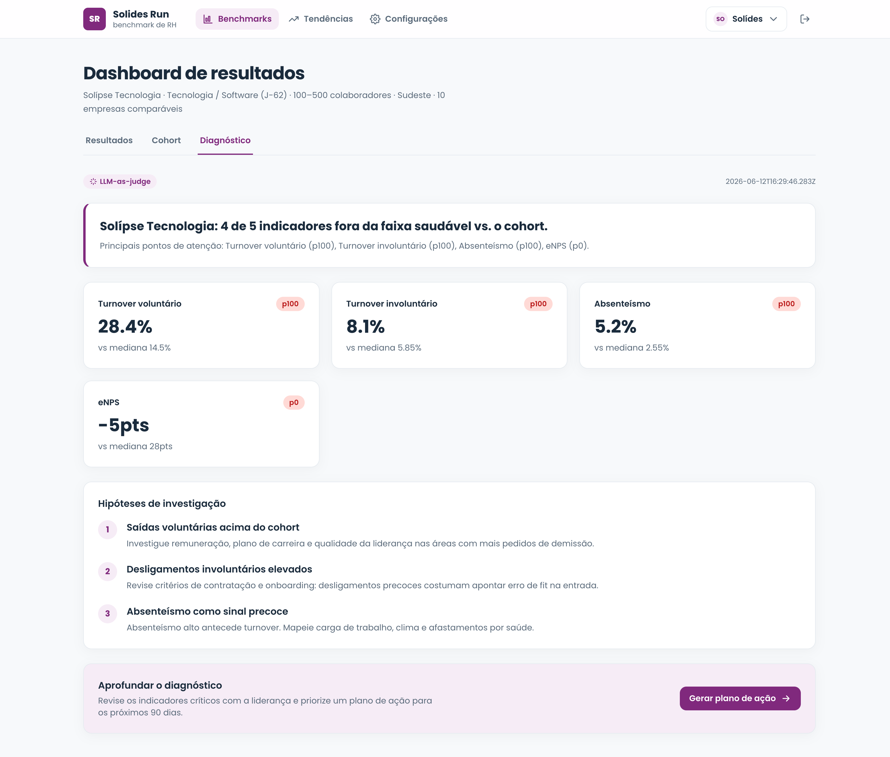

---

## 8. Tendências

`GET /api/benchmarks/:id/trends`. Visão de dois períodos derivada do benchmark
mais recente, com a direção/severidade de cada indicador.

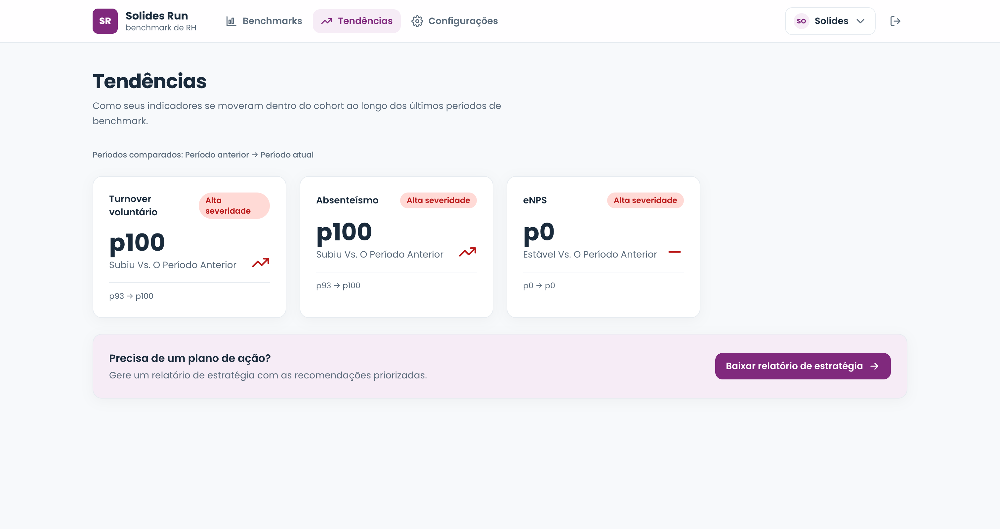

---

## 9. Configurações

Tela de configurações (membros, integrações, privacidade).

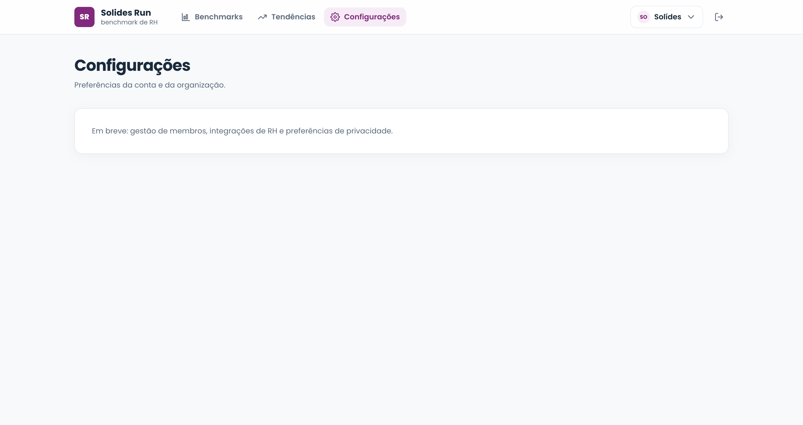

---

## Como reproduzir

```bash
# 1. Ollama com os modelos
ollama pull qwen3-embedding:0.6b
ollama pull awenleven/Qwen3-Reranker-4B:Q4_K_M

# 2. build dos pacotes + subir tudo
pnpm install
pnpm build
pnpm dev            # web :5173  +  api :3000 (proxy /api)
```

Abra http://localhost:5173 e faça login com uma conta demo
(`ana@solides.com` / `solides123`).

**Flags úteis:**
- `VITE_ENABLE_MSW=true` no `apps/web` → roda a UI sobre mocks MSW (sem backend).
- `PIPELINE_STAGE_DELAY_MS=1300` no `apps/api` → espaça as etapas do pipeline
  para a tela de progresso ficar visível (não altera o resultado).
